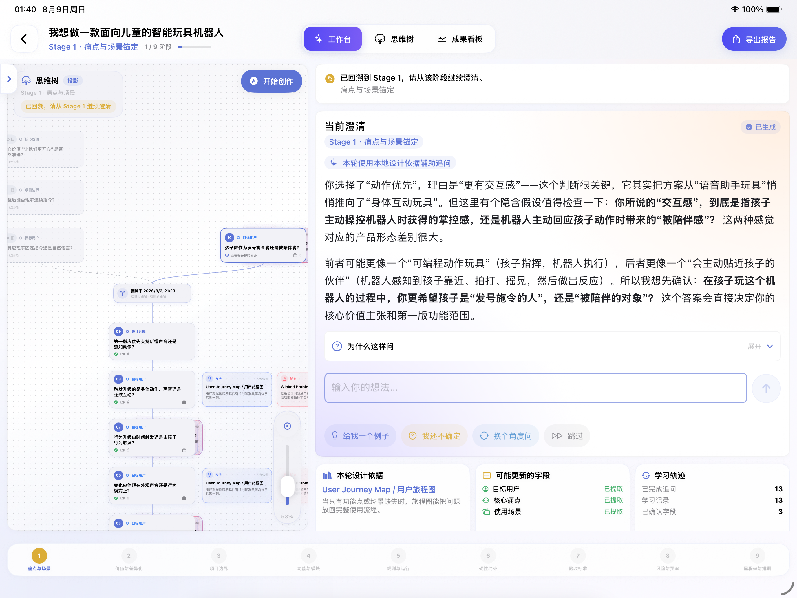
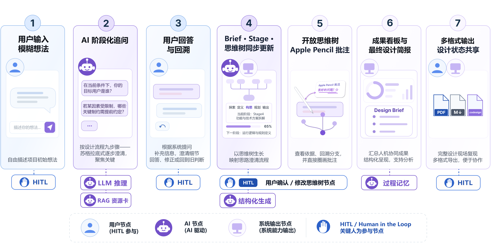

# CoDesign Agent

> **An AI-native design clarification workspace for iPad — helping users form decisions instead of generating answers for them.**

<p align="center">
  <a href="README_CN.md">中文版</a>
</p>


CoDesign Agent v1.2.0 is an **AI-powered design clarification workspace** for design and innovation courses, as well as open-ended projects.

CoDesign embeds large language models in an explainable, revisitable, annotatable, and portable design workflow. Starting from a vague idea, evidence-backed Socratic questions progressively shape a structured Design Brief, while questions, decisions, historical branches, supporting resources, and Apple Pencil annotations are preserved as a project state that can be resumed and extended.

## Product at a Glance

<p align="center">
  
</p>

The iPad workspace keeps the active Thinking Tree, the current clarification, its supporting evidence and nine-stage progress visible in one place—so users can move between conversation, reasoning and structured project state without losing context.

---

## Why CoDesign

The hardest part of an open-ended design project is often not generating features, but forming reliable decisions:

- target users and core scenarios remain vague;
- general-purpose chatbots generate complete solutions too early;
- methods and references are detached from the actual questions being asked;
- linear chat history cannot represent rollback and alternative design branches;
- iPad is often treated as a smaller desktop instead of a native pen-based workspace;
- exported documents preserve conclusions, but lose the reasoning context behind them.

CoDesign is designed around a different principle:

> **AI should help users clarify a project, while preserving how each decision was formed.**

---

## Core Features

### 1. Evidence-backed Socratic Clarification

Each AI turn focuses on the next design variable that can meaningfully change the project.

Internally, CoDesign follows an implicit three-part structure:

```text
Clue
→ Question
→ Basis
```

- **Clue** identifies a missing assumption, contradiction or design gap.
- **Question** asks one open question that can change the Design Brief, Stage or project direction.
- **Basis** provides traceable design methods, papers, cases or principles.

The UI does not expose these as rigid labels. The clue is integrated into natural mentor-style language, while the basis is attached to the corresponding question node as a resource card.

---

### 2. Thinking Tree: Turning Chat into Design Reasoning

Instead of storing AI interaction as a linear conversation, CoDesign projects it into an interactive **Thinking Tree**.

The tree preserves:

- the initial project idea;
- key AI questions and user answers;
- the currently active design branch;
- historical branches after rollback;
- confirmed Design Brief fields;
- completed Stage nodes;
- method and evidence cards attached to questions;
- Apple Pencil strokes and text annotations.

An active Stage remains open while reasoning is still evolving. A Stage completion node is generated only when that Stage is actually closed.

If a user revisits an earlier answer, the previous solution is preserved as history while the new reasoning continues on the active branch.

---

### 3. Native Apple Pencil Annotation for iPad

The annotation system is built with **PencilKit** and designed around iPad-native input behavior:

- Apple Pencil for handwriting, circles, marks and connecting strokes;
- one-finger pan for canvas navigation;
- two-finger pinch for zoom;
- system drawing tools;
- undo, redo and clear;
- persistent strokes and text annotations.

Annotations are not treated as absolute screen coordinates. They are associated with semantic anchors such as question nodes, resource cards and Stages.

When the layout changes, annotations can be reprojected according to the underlying content instead of remaining attached to a stale UI position.

---

### 4. `.codesign`: A Recoverable Project State Package

PDF and Markdown are useful for communication, but they only preserve static results.

`.codesign` preserves a reopenable design workspace, including:

- Project and Stage state;
- structured Design Brief;
- Thinking Tree nodes and parent-child relationships;
- current and historical branches;
- decision paths;
- resource cards and learning traces;
- Apple Pencil strokes;
- text annotations and semantic anchors;
- canvas and stage state;
- schema compatibility metadata.

```text
Export project state
→ Share file
→ Read-only preview
→ Import as a new project
→ Rebuild context
→ Continue reasoning / annotation / iteration
```

At the current stage, `.codesign` is designed for **file-based asynchronous collaboration**, not real-time collaborative editing.

---

## Technical Highlights

CoDesign is not only an AI product prototype. It is also a complete iOS / iPadOS engineering project covering state management, model integration, interaction design, local persistence and project serialization.

### Cross-platform SwiftUI Application

- Built with **SwiftUI** for iPadOS, iOS and macOS.
- iPad is treated as the primary interaction surface rather than a scaled desktop layout.
- The product explicitly supports touch, Apple Pencil and large-screen workspace interaction.

### Local-first State Management with SwiftData

Project data is persisted locally with **SwiftData**, including:

- projects;
- conversations;
- Design Brief;
- Stage progress;
- Thinking Tree;
- learning traces;
- annotations.

Users can close and relaunch the app and continue from the same project state without reconstructing the session from an online conversation.

### Structured AI Pipeline

CoDesign does not follow a simple:

```text
Prompt → LLM → Text
```

pipeline. Instead, each valid user answer can update multiple synchronized product states:

1. conversation context;
2. structured field candidates;
3. user-confirmed Design Brief state;
4. Stage progress;
5. Thinking Tree;
6. learning trace;
7. exportable state.

This turns LLM output into persistent, computable product state rather than transient chat text.

### Mock / Live Dual-mode AI Service

- **Mock Mode** works without an API key and is suitable for offline demos, debugging and deterministic testing.
- **Live Mode** supports OpenAI-compatible Chat Completions.
- `API Key`, `Base URL`, `Model` and `Thinking Type` are configurable.
- The settings screen provides API connectivity validation before switching to live usage.

### OpenAI-compatible Model Layer

The model layer is compatible with OpenAI-style Chat Completions endpoints and can work with services such as:

- DeepSeek;
- Alibaba Cloud Bailian / DashScope;
- other OpenAI-compatible model providers.

The provider can be replaced without redesigning the core product workflow.

### Semantic Annotation Anchoring

The Apple Pencil system includes engineering beyond basic drawing:

- annotations are associated with semantic content;
- strokes can be reprojected after node and Stage layout changes;
- annotations fade when associated resource cards collapse and restore when expanded;
- continuous handwriting uses delayed persistence to reduce high-frequency write pressure.

### Versioned Project Serialization

`.codesign` currently supports `1.0`, `1.1` and `1.2` schemas.

The import workflow includes:

- read-only preview;
- import as a new project;
- node ID remapping;
- parent-child relationship reconstruction;
- annotation anchor reconstruction;
- compatibility paths for future migration.

---

## Tech Stack

| Layer | Technology | Usage |
|---|---|---|
| UI | SwiftUI | iOS / iPadOS / macOS interface |
| Persistence | SwiftData | Project, Brief, Stage, Tree, Trace, Annotation |
| Handwriting | PencilKit | Apple Pencil drawing and annotation |
| AI | OpenAI-compatible Chat Completions | Live clarification and structured generation |
| Offline AI | Mock Service | Demo, test and offline workflow |
| Structured State | Design Brief + Stage Model | Convert conversation into explicit project state |
| Visualization | Custom Thinking Tree | Branching, rollback and resource-node interaction |
| Serialization | `.codesign` | Full project state import / export |
| Output | PDF / Markdown / JSON | Submission, editing, debug and backup |
| Build & Test | Xcode / `xcodebuild` | Simulator, macOS build and automated test path |

---

## Architecture at a Glance

```text
┌──────────────────────────────────────────────┐
│                  SwiftUI UI                  │
│ Home · Workspace · Brief · Tree · Portfolio  │
└─────────────────────┬────────────────────────┘
                      │
┌─────────────────────▼────────────────────────┐
│              Product State Layer             │
│ Project · Stage · Brief · Tree · Trace       │
└──────────────┬─────────────────┬─────────────┘
               │                 │
┌──────────────▼───────┐ ┌──────▼──────────────┐
│      AI Service      │ │  Annotation / Input │
│ Mock / Live / API    │ │ PencilKit + Gestures│
└──────────────┬───────┘ └───────┬─────────────┘
               │                 │
┌──────────────▼─────────────────▼─────────────┐
│             SwiftData Persistence            │
└──────────────┬───────────────────────────────┘
               │
┌──────────────▼───────────────────────────────┐
│  PDF · Markdown · JSON · .codesign Export    │
└──────────────────────────────────────────────┘
```

---

## Product Workflow



The workflow alternates between human judgment and AI assistance: a vague idea becomes a sequence of evidence-backed questions, confirmed decisions and synchronized updates to the Design Brief, Stage progress and Thinking Tree. The resulting design state can then be reviewed, annotated, exported or shared for continued work.

The workflow is organized around nine design Stages:

| Stage | Focus |
|---|---|
| 1 | Pain Point & Scenario |
| 2 | Differentiated Value |
| 3 | Project Boundary |
| 4 | Feature & Technical Decomposition |
| 5 | Runtime Logic & Rules |
| 6 | Hard Constraints |
| 7 | Quantified Acceptance Criteria |
| 8 | Risk & Mitigation |
| 9 | Milestone Planning |

---

## Output Formats

| Format | Purpose |
|---|---|
| PDF | Submission, review and archiving |
| Markdown | Further editing and documentation |
| JSON | Debugging, backup and migration |
| `.codesign` | Full project state, asynchronous collaboration and cross-device continuation |

---

## Runtime Requirements

- iOS / iPadOS 26.4+
- macOS 26.3+
- Xcode with SwiftUI / SwiftData support
- Optional OpenAI-compatible API Key for Live Mode

---

## Quick Start

```bash
git clone https://github.com/Computboy/CoDesign-Agent-Swift.git
cd CoDesign-Agent-Swift
open CoDesign-Agent.xcodeproj
```

Build for iOS Simulator:

```bash
xcodebuild -scheme CoDesign-Agent \
  -destination 'platform=iOS Simulator,name=iPhone 17 Pro' \
  build
```

Run tests:

```bash
xcodebuild -scheme CoDesign-Agent \
  -destination 'platform=iOS Simulator,name=iPhone 17 Pro' \
  test
```

Build macOS:

```bash
xcodebuild -scheme CoDesign-Agent \
  -destination 'platform=macOS' \
  build
```

---

## API Configuration

The application uses **Mock Mode** by default and does not require an API key.

Live Mode can be configured in the settings screen with:

```text
API Key
Base URL
Model
Thinking Type
```

Environment variables are also supported:

```text
LLM_API_KEY=sk-...
LLM_BASE_URL=https://api.deepseek.com
LLM_MODEL=deepseek-v4-flash
LLM_THINKING_TYPE=disabled
```

Configuration priority:

1. App Settings / UserDefaults
2. `LLM_*`
3. Legacy `DEEPSEEK_*`
4. Built-in defaults

---

## Documentation

- [v1.2.0 Product Specification](docs/v1.2.0-product-spec.md)
- [v1.1.0 Product Specification](docs/v1.1.0-product-spec.md)
- [v1.0 App Guide](docs/v1.0-app-guide.md)
- [Product Vision & Design Principles](docs/product-brief.md)
- [Instruction Navigator](docs/Instruction-Navigator.md)

---

## Engineering Notes

Areas worth further engineering work include:

- virtualization and layout performance for very deep Thinking Trees;
- stable semantic annotation mapping after complex layout updates;
- forward / backward compatibility and migration of `.codesign` schemas;
- real-time multi-user editing and branch conflict resolution;
- pluggable LLM providers and on-device model support;
- team-defined Resource Library and retrieval augmentation.

---

## Award

🏆 **Second Prize, East China Division — 2026 Mobile Application Innovation Competition**

From product definition and interaction design to SwiftUI / iPadOS implementation, AI integration, local persistence and competition delivery, CoDesign was developed as a complete end-to-end application project.

---

## Version

Current release: **v1.2.0**

> **Use evidence-backed questions to drive design, an open Thinking Tree to preserve reasoning, Apple Pencil to capture human judgment, and `.codesign` to pass the entire design context to the next participant.**

---

## License

This repository is currently intended for learning, academic showcase and portfolio purposes.
